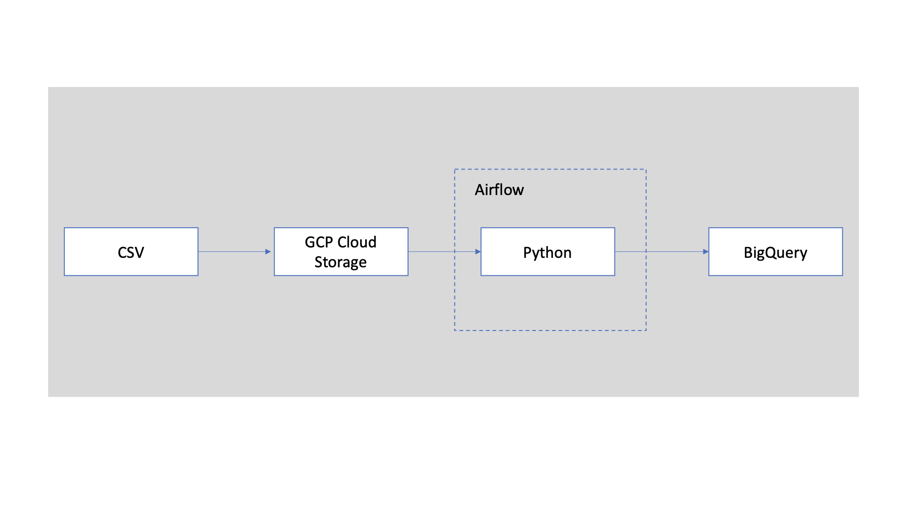

## Introduction

In this project, I have built an ETL pipeline that reads data from GCP cloud storage and uses python to clean and transform the data and create fact and dimension tables in BigQuery. Airflow is used for the workflow orchestration.

## Architecture

## Technology Used

- Python
- Google Storage
- Compute Instance
- BigQuery
- Airflow

## Dataset Used

Source: https://github.com/darshilparmar/uber-etl-pipeline-data-engineering-project/blob/main/data/uber_data.csv

Data Dictionary: https://www.nyc.gov/assets/tlc/downloads/pdf/data_dictionary_trip_records_yellow.pdf

The TLC Yellow Taxi Trip Records were used for this project.

## Data Model

